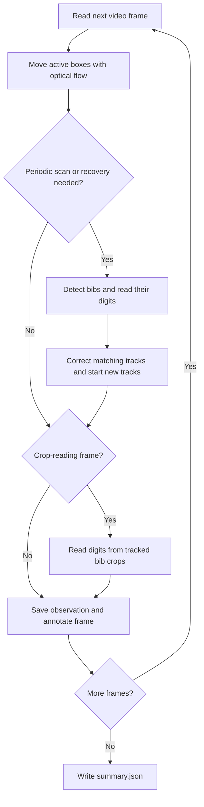

The goal of this project is to create a SaaS application to be able to detect bib at the end of a race, in order to know each runners finish time.
This app could help race organizers to reduce waste and simplify times measurement. It also aims to improve organizers, runners and spectators experience through differents features.
Time measurement precision is discarded because any timestamp of the bib detected is sufficient enough for the finish time : since the video feed will likely film a runner during ~10sec, the finish time incertitude is around 10sec which is good enough for now.

## Selling Ideas

- For examples, we could add checkpoint camera that could help locate runners. This could be particularly useful for trail races where chip checkpoint can't be installed easily in the race route.
- The UI should improve the actual runners and spectator experience.
- Keep record of videos for manual review if needed.
- Personal finish clip
- “Last seen” spectator page

## Development

### Bib tracking

Run the sample with **optical flow every frame**, a full detector scan every 100
frames, and digit reading from tracked crops every 10 frames:

```powershell
uv run python bib_detection.py --detect-every 100 --read-every 10 --output-dir runs/my-test
```

Process the complete sample video with the defaults. Leaving out `--max-frames`
means “continue until the end of the input”:

```powershell
uv run python bib_detection.py --input sample1/video.mp4 --output-dir runs/full-video
```

For a shorter diagnostic with more frequent detection:

```powershell
uv run python bib_detection.py --detect-every 10 --max-frames 150 --output-dir runs/my-short-test
```

Use `--input path/to/video.mp4` for another video. If `--output-dir` is omitted,
each run gets a timestamped directory under `runs/`. Existing output files are
not overwritten. The defaults use the local Darknet weights under `bibobj/`.

The frame loop follows this workflow:



The detector answers “where are the bibs?” Optical flow moves those boxes on the
frames between scans. Digit readings become votes attached to temporary track IDs.

On a detector scan, the model locates bibs and reads their numbers. Each located
bib starts with up to 60 distinctive image points inside its box. OpenCV's sparse
Lucas–Kanade optical flow follows those points between consecutive frames. A
robust transform estimates the box's movement and size change. The tracker checks
points forward and backward, and rejects inconsistent motion or too few points.

Detector scans correct active boxes by overlap and discover new runners. A scan
with no detections does not discard a box whose image features still track well.
Flow failure stops that track immediately and requests another scan. Failed or
empty tracking retries at most once per 10 frames (or the detection interval if
shorter). Empty recovery scans keep the request pending even if another runner
is still tracked. Recovery is currently global: any nonempty detector result ends
the request, even when it did not rediscover every lost runner. Unmatched lost
tracks are not guessed back into existence. Normal periodic scans continue.

Flow can drift, so a track also expires after more than 200 frames without a
matching detector box. This limit is independent of how often scans run. It is
about 6.67 seconds at the sample's FPS. Reappearing lost tracks get new IDs.

Each box receives a temporary ID such as `T3`; the recognized bib is a separate
string. Reading `6500` twice on T3 gives two votes for that string. Flow alone
gives no votes: the digit model must actually read the current image crop.
Unreadable boxes can still match tracks. A tied vote remains
unknown, and conflicting readings remain available for review. Repeated votes
are counts, not calibrated confidence or independent evidence.

`--read-every` controls additional crop reads, independently of `--detect-every`.
Detector scans always read their boxes. A box already read on the current frame
is not read twice. `--no-video` skips annotation and encoding for compute timing;
it still saves observations and summaries.

Each run writes:

- `annotated.mp4`: all source frames at the original FPS. Green boxes were
  matched to detections; cyan boxes follow image features. Labels show ID,
  provisional bib, conflicts and seconds since the last detector match.
- `observations.jsonl`: one record per frame, including the source timestamp,
  whether detection ran, all raw detections (including unmatched weak ones), and
  tracked boxes. `detections: null` means detection was skipped; `[]` means it
  ran but found nothing. Track `source` distinguishes `detection` from `flow`;
  `reading_ran` distinguishes a skipped crop read from an unreadable crop.
- `summary.json`: track votes, first/last seen times (including accepted flow),
  last detector match, configuration, failure/recovery counts, crop-read count,
  runtime and stage timings. These timestamps are not finish-time estimates.

Code is split into three steps: `detector.py` locates and reads bibs;
`optical_flow.py` follows image points, matches detector boxes and keeps votes;
`bib_detection.py` owns the video loop and output. Tracking uses only the existing
OpenCV and NumPy dependencies. No motion-prediction library is required.

**Sample result:** on the first five seconds, optical flow maintained a single
ID for bib 6500 and obtained repeated correct readings. It also retained partial
and conflicting readings, so not every tracked runner has a resolved bib.
See [the measured results and limitations](docs/optical-flow-validation.md).

### Environment

Requires [`uv`](https://docs.astral.sh/uv/). The Python version is pinned in
`.python-version`.

Always use uv to run python code.

```powershell
uv sync                  # create/refresh the .venv
uv run pytest            # run the test suite
uv run ruff format .     # format the code
uv run ruff check .      # lint the code
uv run ty check          # type check the code
uv add numpy             # Add numpy to dependencies
```

### Pre-commit hooks

File hygiene, formatting, linting, type checking and the test suite run
automatically before every commit. The hooks are defined in
`.pre-commit-config.yaml`.

```powershell
uv run pre-commit install          # install the hook, once per clone
uv run pre-commit run --all-files  # run every hook against every file
uv run pre-commit autoupdate       # bump the pinned hook revisions
```

Keep the `ruff` and `ty` versions in `pyproject.toml` in sync with the matching
`rev`s in `.pre-commit-config.yaml`.
